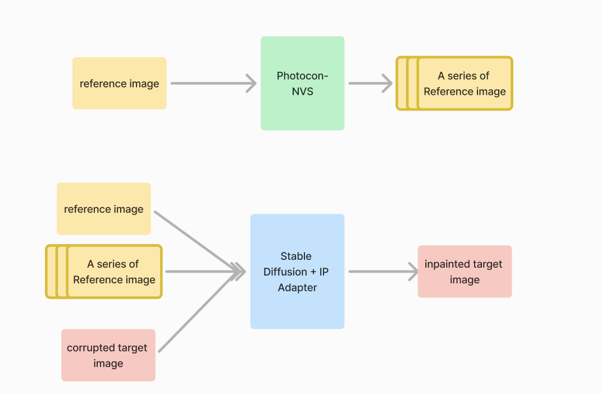

# Reference-based Inpainting

## Introdection
This project tackles the challenge of reference-based inpainting, where the goal is to reconstruct obscured portions of an image from different perspectives. The main challenge stems from significant angular differences between reference images, which complicates alignment and leads to missing information in the obscured areas.

This repository implements a two-pass method based on a Diffusion Model that effectively reconstructs missing content by generating sharp details from random noise. By incorporating stable diffusion with an IP-adapter for targeted guidance, the model enhances image fidelity. Additionally, the two-pass approach uses multiple reference images from various angles to produce more accurate and detailed reconstructions.

## Method

reference image -> Photoconsistent-NVS -> A series of refernece images
A series of reference images + reference image -> Stable Diffusion + IP-Adapter -> Inpainted image

## Repository Used
[Photoconsistent-NVS](https://github.com/YorkUCVIL/Photoconsistent-NVS): Generates multiple images from a single reference image based on a defined trajectory..
[Diffuser IP-Adapter](https://github.com/cubiq/Diffusers_IPAdapter): Supports the use of multiple reference images with Stable Diffusion and IP-Adapter.

## Usage

### Data generation in `src/data`:
+ `download.py`: Script for preparing the [RealEstate10k dataset](https://google.github.io/realestate10k/download.html). Download the data from the RealEstate10K official repo before running this script, as it downloads images based on the dataset.
+ `generate_mask.py`: Generates custom masks for targe image.
+ `resample_spec.py`: Generates trajectories for each sample, required by Photoconsistent-NVS for resampling.
+ `struct_folder_photocon.py`: Helps create the required folder structure for Photoconsistent-NVS.
+ `structure_folder_sd.py`: Takes image pairs from the same scene, applies the mask, and organizes them into directories for use in Stable Diffusion.

